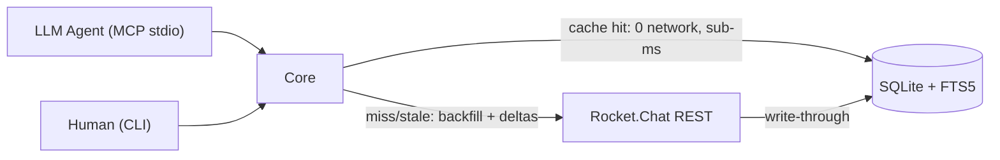

I wanted my LLM agents to read my Rocket.Chat: summarize long threads, tell me what I missed, reply where I point them. The obvious build is a thin MCP server that proxies the REST API. I built that plan first — and threw it away an hour later, because the right answer was a local SQLite cache with full-text search, and an agent that never waits on the network twice for the same message.

This is the full story of building [rocket-cli](https://github.com/jeanfbrito/rocket-cli) in one long Claude Code session orchestrating a fleet of subagents: 24 commits, 216 tests, 17 MCP tools, 17 CLI commands, zero merge conflicts across five parallel build waves — and a forensic debugging session on a subtle SQLite FTS5 corruption bug. Full cost breakdown at the end: the whole thing ran $161.65 in API spend over roughly four hours.

## Planning against the server's source code, not its docs

The session started in plan mode with one unusual advantage: I keep the Rocket.Chat OSS monorepo indexed in a code knowledge graph. Instead of reading API docs (which drift) or guessing from typings (which describe the latest version, not your deployment), the planning phase dispatched two explorer agents straight into the server source — `apps/meteor/app/api/server/v1/` — and came back with the actual contract:

- `channels.history` / `groups.history` / `im.history` are type-specific endpoints sharing one backend; you must route by room type, a single endpoint can't work
- `chat.syncMessages` returns `{ updated[], deleted[] }` — deltas carry **edits and deletions**, the perfect cache-invalidation primitive
- `subscriptions.get` returns *every* room the user can read in one unpaginated call, with name, type, and unread state — a free room directory
- The default API rate limiter: 10 calls per 60 seconds per endpoint. A stateless proxy would hit this constantly; a cache makes it irrelevant after first touch
- PAT auth is just two headers, and PATs created with "Ignore Two Factor Authentication" work unattended

Every fact in the plan carried a `file:line` citation. That paid off repeatedly: whenever published typings and live behavior disagreed later (they did, three times), we already knew which source file held the truth.

### The stack pivot

I'd picked Python + FastMCP. Mid-planning I realized something better: Rocket.Chat publishes its internal packages to npm *from the same monorepo as the server* — `@rocket.chat/rest-typings` (every endpoint's params and results, typed) and `@rocket.chat/api-client` (a typed REST client over those typings). Switching to TypeScript meant the platform itself would type-check our integration.

Before committing, a planner agent read the api-client source and surfaced three corrections that would have been runtime surprises:

1. Credentials are keyed by literal header names: `{ 'X-User-Id': ..., 'X-Auth-Token': ... }` — not `{ token, userId }`
2. The constructor appends `/api` to your base URL itself
3. **Non-2xx responses reject with the raw fetch `Response` object, not an Error.** Your catch block needs `instanceof Response`, then `.status`, then a guarded `.json()` because proxies return HTML on 502

And one bonus discovered at `npm install` time: a transitive dependency ships a Yarn-only `patch:typia@npm%3A9.7.2#~/.yarn/patches/...` URL in its public npm metadata. npm refuses the `patch:` protocol outright. The fix is an override:

```json
"overrides": { "typia": "9.7.2" }
```

That's a monorepo publishing pipeline leaking its internal patch protocol into the public registry — now permanently documented in the repo's `KNOWN_ISSUES.md`.

### The plan I threw away

Version 1 was the thin stateless proxy: six MCP tools, each call hitting the REST API. Complete plan, tool schemas, error mapping, the works. Reviewing it, the obvious flaw: an agent summarizing a 200-message thread re-fetches those 200 messages every conversation, fighting a 10-req/min rate limiter the whole way.

Version 2 became the actual architecture:



One binary, two faces: `rocket-cli serve` speaks MCP over stdio for agents; the same core powers human CLI commands. First read of a room backfills up to 500 messages. After that, `chat.syncMessages(lastUpdate)` deltas keep it fresh on a 60-second TTL. Repeat reads are sub-millisecond SQLite slices. Search is local FTS5 `MATCH` across *every cached room at once* — something the server API literally cannot express, since `chat.search` is room-scoped.

## Schema decisions that mattered

The FTS index is an external-content FTS5 table (no duplicate text storage, `snippet()` still works), kept in sync by triggers. Three decisions here earned their keep:

**Tokenizer: `unicode61 remove_diacritics 2`, explicitly no Porter stemming.** My chat is mixed Portuguese and English. Porter is an English stemmer; it mangles Portuguese. Diacritic folding is the high-value normalization — `funcao` finds `função` — and it works for both languages. There's a unit test asserting exactly that match.

**Soft deletes flow through the index automatically.** Messages are never hard-deleted (deltas mark them `deleted=1`); the triggers are written so flipping that flag evicts the row from FTS. The initial builder split the UPDATE trigger into two `WHEN`-guarded halves — one for the delete-side (`WHEN old.deleted=0`), one for the insert-side (`WHEN new.deleted=0`) — so FTS never receives a `'delete'` for a row that was never indexed. With external-content tables, that mismatch corrupts the index. This foresight was correct… and still not enough, as Act 4 will show.

**Column ownership in the upsert conflict clause.** The `rooms` table holds two kinds of state: subscription-sourced fields (name, unread count) and sync watermarks (`last_synced_at`, `oldest_loaded_ts`). The first version of the room upsert updated everything on conflict — meaning every 5-minute subscription refresh *wiped the sync state*, silently re-triggering full backfills. The fix is boring and load-bearing: watermark columns are simply absent from the `ON CONFLICT SET` list. Different writers own different columns, and the conflict clause is where that ownership is enforced. There's a dedicated test asserting the split.

The sync engine itself runs on three principles:

- **Watermark before fetch.** `syncStart` is recorded *before* the first request, so anything arriving mid-sync gets re-fetched next round. Safe because upserts are idempotent.
- **Per-room mutexes, global semaphore.** Concurrent reads of the same room coalesce into one in-flight sync; a 2-slot semaphore caps total API concurrency; 429s back off with `Retry-After`.
- **Threads self-heal by count comparison.** Thread replies are room messages, so deltas keep them fresh for free. The gap is initial backfill — solved without TTLs by comparing the server's authoritative reply count (`tcount` on the parent) against the local count on read, fetching only when they disagree.

## Running five builders in parallel without merge conflicts

The build ran as waves of background builder agents, up to three concurrently. The classic failure mode for parallel codegen: every new MCP tool wants a line in `server.ts`, every CLI command a line in `index.ts`. Two agents, one file, merge conflict with extra steps.

The pattern that emerged — and survived two full feature waves with five builders and zero collisions — is **registration deferral**: each builder creates self-contained module files exporting `register*()` functions and is explicitly forbidden from touching the registration files. Briefs include a DO-NOT-TOUCH list naming the parallel builders' files. A final cheap wiring agent registers everything, bumps the tool-count assertions, updates the README, and runs end-to-end verification. The wiring wave doubles as the integration checkpoint.

Two refinements made it robust:

**Shared test files belong to the wiring wave too.** Each builder writes its own test file; the shared `mcp.test.ts` with its "N tools registered" assertion is only ever touched by the wiring agent. Otherwise every parallel builder would race to bump the same number.

**Mid-flight scope changes go to the running agent, not a new one.** While the emoji-discovery builder was mid-implementation, the requirements grew three times: also cache the emoji images as blobs; make all image fetching lazy so the MCP request path never blocks; add an env toggle to disable blob storage entirely. Each extension went to the *running* agent as a message. It folded all three into a single coherent schema migration instead of three stacked ones. Killing and re-dispatching would have produced v3, v4, v5 migrations for one feature.

The one seam that did appear: two parallel builders each declared the same row types (one in `db.ts`, one in a new `types.ts`). Caught immediately after the wave, unified by a 5-minute fix agent. Parallel codegen doesn't eliminate integration work — it concentrates it into small, predictable seams.

## The dogfooding wave, and a textbook FTS5 corruption case

With everything green — tests passing, typecheck clean, MCP inspector listing tools — I pointed the system at my own test server and told the agents to dogfood every feature. The 13-step live run came back: 11 pass, 2 "critical defects". Thread replies invisible. Search returning nothing for words plainly visible in the timeline.

The debugging agent got an evidence-first protocol: inspect the actual SQLite rows, curl the live API and capture real response shapes, read the server handlers via the code graph, and only then touch the code. The findings were a perfect specimen of why this order matters:

**Two of the three symptoms weren't bugs at all.** The dogfooding agent had sent its "thread replies" without the `tmid` parameter — its own scripting error — and then inspected a cache snapshot from *before* its replies existed. The thread machinery was correct. If the debugger had started "fixing" thread code, it would have mangled working logic chasing a test-harness mistake.

**The third symptom was a genuine and instructive bug.** The search misses traced to FTS5 external-content corruption — but not the kind the careful trigger design had guarded against:

Delta sync re-upserts already-known rows every cycle; that's what idempotent `ON CONFLICT DO UPDATE` is for. Each such no-op re-upsert fired the UPDATE triggers: `'delete'(old tokens)` followed by `INSERT(new tokens)` — identical tokens, same rowid. For an FTS5 external-content table, that pair corrupts the term's posting list: the document frequency nets out to zero, the row becomes unsearchable, **and FTS5's own `integrity-check` passes**. The index is wrong and certifies itself as fine.

The reproduction is two statements:

```sql
INSERT INTO messages (id, text, ...) VALUES ('x', 'find me', ...);
-- MATCH 'find' → 1 row
INSERT INTO messages (id, text, ...) VALUES ('x', 'find me', ...)
  ON CONFLICT(id) DO UPDATE SET text = excluded.text;
-- MATCH 'find' → 0 rows. Same content. Index corrupted. integrity-check: OK.
```

The fix: guard the triggers on *actual content change*, so unchanged re-upserts never touch the index, plus a migration that runs `INSERT INTO messages_fts(messages_fts) VALUES('rebuild')` to repair databases already corrupted in the field:

```sql
CREATE TRIGGER messages_au_del AFTER UPDATE ON messages
WHEN old.deleted = 0
 AND (new.deleted = 1 OR new.text IS NOT old.text
      OR new.author_username IS NOT old.author_username)
BEGIN
  INSERT INTO messages_fts(messages_fts, rowid, text, author_username)
  VALUES('delete', old.rowid, old.text, old.author_username);
END;
```

If you run FTS5 external-content under any cache layer that re-upserts rows — and every delta-sync design does — guard your triggers on content change and write a `MATCH`-after-identical-re-upsert regression test. `integrity-check` will not flag this corruption.

The same dogfooding run also caught Commander.js silently dropping program-level `--json` flags (action handlers must read `optsWithGlobals()`, not their local `opts`) — pure integration-layer plumbing that no unit test exercises.

## When typings diverge from the live server, cite the source

The debugging session produced a second discovery worth its own section. `@rocket.chat/rest-typings` declares `chat.syncMessages`'s response cursor as **required**. The live server, on the `lastUpdate` code path, returns no cursor at all — it ignores `count` and ships *everything* since the watermark in one response. The cursor exists only in a separate pagination mode (`type=UPDATED` + `next`/`previous`) that's mutually exclusive with `lastUpdate`. The handler is `handleWithoutPagination` in `apps/meteor/server/publications/messages.ts`; the published type describes the union of both paths, the wire shows you one.

Two more divergences turned up the same way: `im.history` returns a narrower message projection than its channel/group siblings, and `emoji-custom.list` only populates its `remove[]` array on the `updatedSince` delta path.

This shaped the typed-client refactor that followed (three waves: typed surface → consumer migration in two parallel builders → cleanup). The result: one typed method per endpoint, params and results derived from rest-typings, the stringly-typed `rc.get('/v1/...')` generics deleted, and every `as never` cast quarantined inside a single private helper. The policy where reality diverges: define a narrow local interface *with a comment citing the server source file*. Never blanket-cast. Even test fakes are typechecked against the real method signatures via `Pick<RcClient, ...>` guards — so endpoint contract drift now fails compilation instead of surfacing at runtime.

A small irony: the refactor was prompted by asking "are we actually using the platform's types?" mid-session. We weren't — the first builder had bypassed the strict path-pattern generics with casts. The dogfooding bug we'd just fixed (response-shape mismatch) was exactly the class of bug the bypassed types would have caught at compile time.

## Comparative research: adopt, defer, reject

Two comparative mining runs went out against other indexed codebases: a community Mattermost MCP server, and my own agent-dispatch system that polls Rocket.Chat directly.

The Mattermost comparison mostly *validated* the cache: it has none — every tool call is 6–9 live API requests — and its flat per-call design confirmed which of our choices (compact JSON, freshness metadata, structured errors) were differentiators. Adopted from it: reaction and user-profile tools, both trivial. Rejected: pretty-printed JSON output (tokens are product cost when your users summarize threads), and its cron-based topic monitor — though that idea came back later, better.

The second mining run produced a reversed conclusion, which is the part worth remembering: most of that system's patterns (dispatch framing, session memory) belong in the *consumer* layer, not the MCP — but its hand-rolled polling/dedup loop over the Rocket.Chat API is exactly what rocket-cli's cache + `watch` command now does better. The mined codebase shouldn't be mined for features; it should become a *client*. Idea-mining sometimes tells you who your users are.

The `watch` command that came out of it: poll on an interval, force-sync the watched rooms, run a *local-only* FTS query above a timestamp watermark — zero server-search calls, so polling never touches the rate limiter — stream matches to stdout or a notify target, append a JSON-lines audit log, survive tick errors, die cleanly on SIGINT.

## "What needs my attention" — the actual product

Somewhere mid-session the goal crystallized: everything else is plumbing for one question — *what needs my attention?* The final wave built that pipeline as four features in dependency order, three of them in parallel:

**Permalinks everywhere (outbound).** Every message any tool emits carries its `/channel/name?msg=id` link, format verified from the Rocket.Chat client source (`getPermaLink` + the room-type route definitions — DMs link by `rid`, not username). Agent summaries cite clickable sources.

**URL resolution (inbound).** The exact inverse parser: every room parameter accepts a pasted channel URL, every message-id parameter accepts a `?msg=` link, and reading the client's route definitions surfaced a second thread-URL form (`/channel/name/thread/tmid`) that in-app navigation produces — both forms parse. An `open_url` tool takes *any* Rocket.Chat link and returns the content plus an `affordances` block: ready-to-paste ids for the follow-up actions (`replyInThread`, `reactTo`, `room`). The tool teaches the agent its next move. Outbound generator and inbound parser live as exact inverses — I click what the agent cites, the agent opens what I paste. That loop is the real human↔agent contract for chat tools.

**Exact unread, not approximate.** The server had been handing us the answer all along: `subscriptions.get` carries `ls` (your per-room last-read timestamp — literally the moment you last touched the room in the UI) and `tunread[]` (unread thread ids). Store those, and "unread" becomes an exact SQLite slice — `WHERE ts > ls` — plus the thread replies the main timeline never shows. No "newest N ≈ unread N" approximation. And one guarantee enforced by test: a recording fake asserts that no read-marking endpoint is *ever* called. Checking what's unread must never clear your badges.

**Mentions, then the digest.** A schema migration adds a `mentions` column (queried via SQLite's `json_each` with a partial index), your own username gets cached after one `users.info` call, and `get_mentions` answers "where was I @-mentioned" across every cached room. Then `get_attention` composes it all: mentions → unread DMs → unread thread replies → unread channel messages, deduplicated by message id (a mentioned message that's also unread appears once, flagged `alsoUnread`), every item permalinked, one tool call.

```
▌ MENTIONS
  #general
    [14:39] @jean: hey @jean check this mention test
      https://chat.example.com/channel/general?msg=PMpFjngX6pgjqbLka
▌ DIRECT MESSAGES
  @rocket.cat
    [12:32] @rocket.cat: *Update your Rocket.Chat*
4 items need your attention: 1 mention, 3 DMs, 0 threads, 0 channels.
```

One detail from this wave deserves a callout because the *builder caught the architect's mistake*: my brief for the message-context tool specified building the "N messages after the target" slice by reversing a `WHERE ts > target ORDER BY ts DESC LIMIT N` query. That returns the newest N rows after the target — a gap — not the nearest N. The before-slice has no such problem, which is exactly why the asymmetry slips through. The builder's first test run caught it and fixed it with a bounded over-fetch. Plans written by the orchestrator are hypotheses; builders with tests are the falsifiers.

## Implementation notes worth recording

**File uploads bypass the client library entirely.** api-client's `upload()` is `XMLHttpRequest`-based — browser-only, dead in Node. Uploads are raw `fetch` + `FormData` against the two-step flow the server source revealed: `POST /v1/rooms.media/:rid` (multipart, returns a pending file id that expires in 24h) then `POST /v1/rooms.mediaConfirm/:rid/:fileId` (carries the caption and thread id, creates the message). Downloads turned out to accept the same two auth headers directly — there's a fallback path in the server's `FileUpload.ts` that reads `x-auth-token`/`x-user-id` when the usual cookie/query auth is absent.

**Custom emojis worked with zero code changes.** `chat.react` accepts any emoji registered on the server. The live test created a custom emoji via `emoji-custom.create` (multipart, admin-only), reacted with it through the existing tool, done. What was missing was *discovery* — so a cached emoji registry (same TTL + delta pattern as rooms) now backs a `list_custom_emojis` tool, lazy-cached image blobs (request paths never wait; a never-resolving fetch in tests proves `refresh()` can't hang), and the part I like most: reaction errors became self-correcting. Misspell `:rockt:` and the error answers `Invalid emoji … similar registered: rocketcli. Use list_custom_emojis.` The agent fixes its own typo without another discovery round-trip.

**The reviewer waves earned their cost.** After each multi-builder wave, a reviewer agent swept the seams: verified the permalink generator and URL parser are exact inverses, confirmed migration idempotence, analyzed a `Promise.all` that double-fires the subscription refresh (harmless — idempotent upserts — but flagged as a wasted API call), and caught a genuine latent risk that became documentation: external-content FTS5 keys on SQLite rowids, and a manual `VACUUM` can renumber them. The tool never vacuums, but a user running `sqlite3 cache.db VACUUM` by hand would silently break search. That's now in `KNOWN_ISSUES.md` with the rebuild incantation.

## What it cost

Full transparency, straight from the session's usage report:

| | |
|---|---|
| Total API cost | **$161.65** |
| API time | 3h 58m |
| Wall-clock time | 4h 38m |
| Code produced | 14,229 lines added, 836 removed |

Per-model breakdown — the orchestration tiers in action:

| Model | Role | Output tokens | Cache read | Cost |
|---|---|---|---|---|
| Fable 5 | orchestrator + planning | 229k | 88.3M | $108.73 |
| Opus 4.8 | builder-smart agents | 451k | 50.4M | $45.94 |
| Sonnet 4.6 | builder-fast agents | 77k | 8.0M | $5.55 |
| Haiku 4.5 | watchers / testers | 76k | 5.9M | $1.43 |

A few readings worth pulling out. The orchestrator cost more than all the builders combined — not because it wrote code (it almost never did), but because it held the long-running session context: 88 million cached tokens read across a four-hour conversation. The smart builders produced almost twice the orchestrator's output tokens at less than half its cost, which is the entire argument for the dispatch pattern: expensive context stays in one place, code generation happens in cheap, disposable contexts. And the watchers — the agents that ran every test suite, build, live smoke, and dogfooding sweep so their output never flooded the main session — cost $1.43 total. The session report attributed 95% of usage to subagent-heavy work, which is exactly what it was.

Whether $162 is expensive depends on your baseline. For a working, tested, documented, published tool with 216 tests and a forensically debugged storage layer, built in an afternoon — it's a number I'll take.

## Takeaway

Four things I'd carry to the next build:

1. **Ground truth beats documentation.** Reading the server's handler code during planning — and again during debugging — resolved every types-vs-reality dispute instantly. When integrating against any large OSS platform, index its source and make your agents cite it.
2. **Parallel agents work when file ownership is explicit.** Registration deferral plus DO-NOT-TOUCH lists turned shared-file contention into a non-problem across five concurrent builders. And message the running agent for scope changes — coherent migrations beat stacked ones.
3. **Evidence before fixes.** Two of three "critical bugs" from dogfooding were the test harness's own errors. The debugging protocol — inspect rows, capture wire shapes, read server source, *then* edit — prevented mangling correct code, and found the real bug's actual root.
4. **Tests verify your assumptions; dogfooding verifies reality.** The FTS5 posting-list corruption and the dropped CLI flags both sailed through a green suite and fell over within minutes of live use. Budget for both, every time.

The repo is public: [github.com/jeanfbrito/rocket-cli](https://github.com/jeanfbrito/rocket-cli). MIT, Node ≥ 20, works with any MCP client.

---

*Written with [Fable 5](https://www.anthropic.com/claude) (`claude-fable-5`) via Claude Code.*
