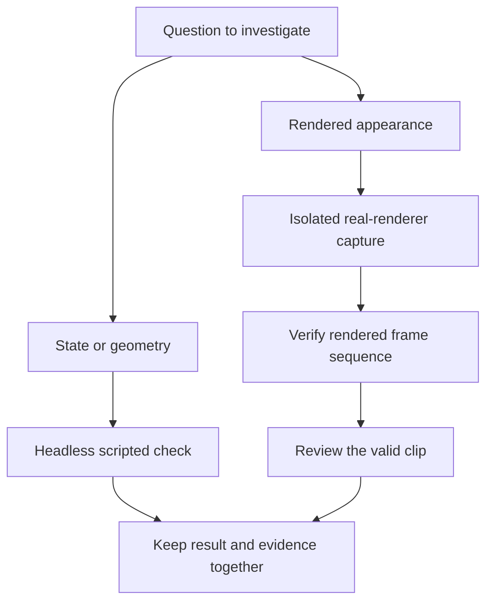

At one point I asked a very practical question: could these tests run headlessly so my mouse would stop being captured while the agent tested **Shoot to Thrill**? It was an interruption problem before it was an architecture problem. I wanted to keep using my computer while the prototype performed its own scripted work.

That request changed more than the launch command. It forced a clear separation between gameplay checks, visual recording, and interactive play. It also exposed weaknesses in what we had been accepting as evidence. This post follows [the walking investigation]() into the test workflow that supports it.

## Start with the right kind of evidence

Some questions are about state and geometry. Did the action happen? Was the target reachable? Did a foot remain supported for the required interval? Those questions do not inherently need a visible game window, and they are good candidates for automated headless checks.

Other questions are about the rendered result. Does the weapon remain readable in the viewport? Does a hand look connected throughout a transition? Does the camera make the movement feel abrupt? A numerical trace can support those investigations, but it cannot replace the actual image.

The workflow needed both kinds of evidence without letting them borrow authority from each other. A passing headless run should not certify a visual capture. A good-looking clip should not conceal a missing action or an incomplete test sequence.

This separation also made failures easier to describe. If the engine check passed but the recording was incomplete, I could say exactly that. There was no need to call the entire experiment successful or unsuccessful as a single undifferentiated event.

## Headless execution is a useful starting point



_Conceptual workflow diagram. It explains which evidence belongs to a question; it is not a measured performance chart or a claim that either branch establishes player feel._

Godot exposes command-line options for selecting a project, running headlessly, fixing the simulation frame rate, and ending after a specified number of iterations. The exact flags are documented in the [Godot 4.5 command-line reference](https://docs.godotengine.org/en/4.5/tutorials/editor/command_line_tutorial.html).

For a project of your own, a generic smoke-run shape is:

```bash
godot --headless --path /path/to/your/project \
  --fixed-fps 60 --quit-after 120
```

This command is only an engine launch example. It does not contain our private test fixtures, select useful assertions, or prove that any particular gameplay behavior is correct. A meaningful test still needs a known starting condition, deliberate actions, observations, and an explicit result.

That distinction helped keep the command from becoming a magic incantation. Running without a window solved the desktop interruption for those checks. It did not automatically solve reproducibility, coverage, or interpretation.

## Automation has to be recognized before interaction starts

Releasing the mouse after a fixture begins is too late if startup has already captured it. The same problem applies to focus: a window can interrupt the user before the first scripted action runs. The automation contract therefore has to apply from the beginning of the process.

For this project, automated runs must not capture, confine, or hide the mouse, take keyboard focus, or consume live user input. Scripted input belongs to the experiment. The user's keyboard and mouse belong to the user.

Visual captures have an additional constraint because they need the real renderer. They use a guarded recording path with a no-focus window, visible cursor, isolated scripted actions, and separate temporary settings. If a rendering path cannot satisfy those conditions, it needs to be fixed before being used for unattended capture.

These are requirements of our automation workflow, not promises that a single engine flag provides all of them. Making that explicit prevented a headless launch option from being mistaken for a complete safety boundary.

## Fixed timing makes comparisons easier to interpret

The recordings used a fixed 60 FPS profile so that repeated takes had a consistent time basis. That was useful for comparing onset, recovery, and short trajectory changes. The recorder also checked actual observed timing rather than relying only on the command we intended to launch.

Input profiles needed the same care. My interactive preference is toggle aim, while older scripted takes used a hold profile. If those profiles were mixed without being recorded, the comparison could attribute an input difference to an animation change.

The useful habit was to write down the conditions that define a take: scenario, input profile, presentation, timing, and source state. A comparison with missing identity remained uncertain. Filling in the missing values from memory would make the output look cleaner while weakening the evidence.

Even with those conditions controlled, fixed timing is only one part of reproducibility. The test still has to observe the right stage of the animation and include the transitions relevant to the claim.

## The final pose is the one the viewer gets

The walking work made sampling order particularly important. A target may be updated before the final skeleton has finished responding to it. Reading an earlier value and calling it the rendered foot would mix two stages of the pipeline.

The recorder therefore tracks fresh final-skeleton observations. A sample needs evidence that the relevant update happened for that frame. A repeated old value can be perfectly well-formed data and still be the wrong observation for the question.

This is a general testing lesson: know where in the lifecycle the result becomes authoritative. For animation, intermediate intent and final modified pose can differ. For a UI, requested state and painted pixels can differ. A test should say which one it observed.

In the prototype, this distinction helped separate solver behavior from target behavior and made the contact measurements easier to trust. It did not replace visual review; it made the supporting numerical evidence less ambiguous.

## A folder of images is not proof of a recording

Godot's [movie creation documentation](https://docs.godotengine.org/en/4.5/tutorials/animation/creating_movies.html) describes recording project output, including image sequences. That gives a useful recording mechanism. Our experience showed why a test workflow still needs to validate what was actually produced.

On this setup, a capture could contain the expected number of PNG files while repeating images when the window was occluded. Counting files alone would accept the sequence. The test could appear complete even though parts of the visible action had not been captured correctly.

The guarded capture path therefore checks rendered frame identities and retains the verification result with the recording. An incomplete or repeated sequence must not become a successful visual check simply because the engine process exited or enough filenames exist.

There is an important boundary in the newer importer too: it can audit existing receipts and image integrity, but it does not yet independently decode every historical frame marker. A historical receipt and a fresh independent verification are different claims. The output preserves that distinction.

The sequence rule can be expressed independently of the game. This teaching example assumes another step has already decoded a counter from each rendered image:

```python
def require_sequence(frame_ids, expected_count):
    """Check already-decoded IDs, not the pixels of a recording."""
    if expected_count <= 0:
        raise ValueError("A recording must contain frames")
    if frame_ids != list(range(1, expected_count + 1)):
        raise ValueError("Incomplete, reordered, or repeated frame sequence")

require_sequence([1, 2, 3], 3)
# require_sequence([1, 2, 2], 3) raises ValueError.
```

The repeated sequence has the right number of entries and still fails. That is the distinction a file count misses. This snippet does not decode pixels or prove that a renderer produced fresh frames: the counter has to come from the rendered image, and its relationship to the capture clock must already be established.

For a concrete example, the source recording used in parts one through three retained 1,201 contiguous, unique rendered markers, numbered 1 through 1,201, and passed its capture guard. The public twenty-second clip encodes the first 1,200 source frames at 60 FPS. A lossy viewing copy is useful for motion review; the original image sequence and capture receipt are what established the sequence check.

## Keep capture settings away from the interactive project

Changing project settings for a recording can create another kind of interference. The next interactive launch may inherit a capture-specific configuration, or a test may accidentally depend on a setting that was left behind by an earlier run.

The capture workflow uses an isolated temporary project view for its settings. That keeps the interactive configuration stable while allowing the recording to use its explicit profile. The principle is the same as isolating test data: the experiment should own its temporary state.

Source snapshots later extended that idea to headless jobs. A running test should not quietly change meaning because another edit lands in the working tree halfway through. Recording exactly what ran makes it possible to interpret a result after the session has moved on.

## What the workflow now promises

Automated gameplay checks run headlessly. Visual validation uses the real renderer through a guarded path. Both keep their profiles and evidence explicit, and neither is allowed to treat the user's live input as part of the experiment.

The result is not a promise that every animation is correct. It is a better boundary around the process that judges the animation. I can keep using my desktop, and the tool has to distinguish completed execution, valid capture, measured behavior, and visual acceptance.

That separation becomes even more valuable when an AI agent is coordinating the work. Once the recordings and measurements are reliable enough to reuse, the next question is how much of them should enter the conversation at all. That is the subject of the final post in this series.

## Continue the series

- [1. Learning to See Weight]()
- [2. Recoil Needs a Shoulder]()
- [3. The Transitions Carry the Weight]()
- [4. Why Passing Feet Still Look Wrong]()
- **5. Testing Without Taking My Mouse** — this post
- [6. Small Results, Honest Evidence]()

---

_Written with [GPT-6](https://openai.com/) (exact model ID unavailable) via Codex._
